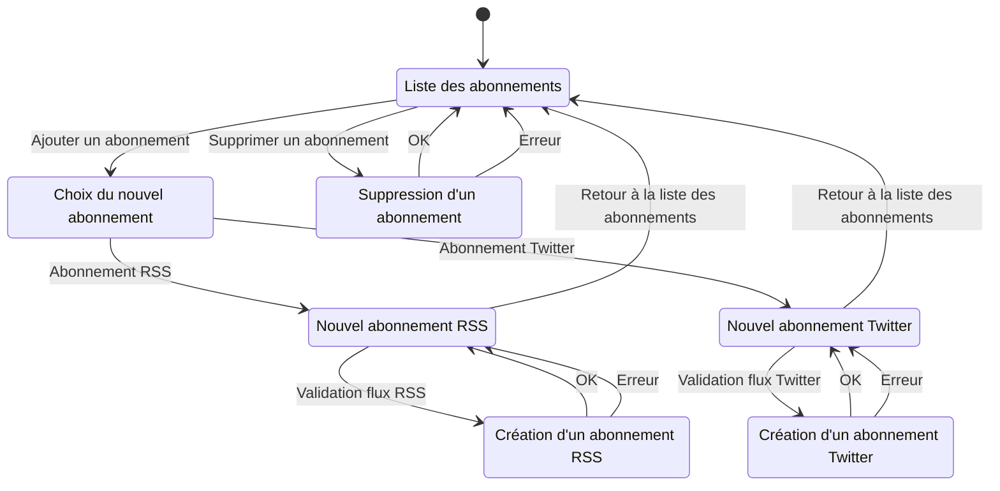

# abonnements

## Diagramme d'état

Aller à l'état initial : [Liste des abonnements](#Liste_des_abonnements)  
## Liste des abonnements

Test description

### Actions

- Supprimer un abonnement [Suppression d'un abonnement](#Suppression_d'un_abonnement)  
- Ajouter un abonnement [Choix du nouvel abonnement](#Choix_du_nouvel_abonnement)  
## Choix du nouvel abonnement

### Actions

- Abonnement RSS [Nouvel abonnement RSS](#Nouvel_abonnement_RSS)  
- Abonnement Twitter [Nouvel abonnement Twitter](#Nouvel_abonnement_Twitter)  
## Nouvel abonnement RSS

### Actions

- Validation flux RSS [Création d'un abonnement RSS](#Création_d'un_abonnement_RSS)  
- Retour à la liste des abonnements [Liste des abonnements](#Liste_des_abonnements)  
## Nouvel abonnement Twitter

### Actions

- Validation flux Twitter [Création d'un abonnement Twitter](#Création_d'un_abonnement_Twitter)  
- Retour à la liste des abonnements [Liste des abonnements](#Liste_des_abonnements)  
## Suppression d'un abonnement

### Actions

- OK [Liste des abonnements](#Liste_des_abonnements)  
- Erreur [Liste des abonnements](#Liste_des_abonnements)  
## Création d'un abonnement RSS

### Actions

- OK [Nouvel abonnement RSS](#Nouvel_abonnement_RSS)  
- Erreur [Nouvel abonnement RSS](#Nouvel_abonnement_RSS)  
## Création d'un abonnement Twitter

### Actions

- OK [Nouvel abonnement Twitter](#Nouvel_abonnement_Twitter)  
- Erreur [Nouvel abonnement Twitter](#Nouvel_abonnement_Twitter)  
