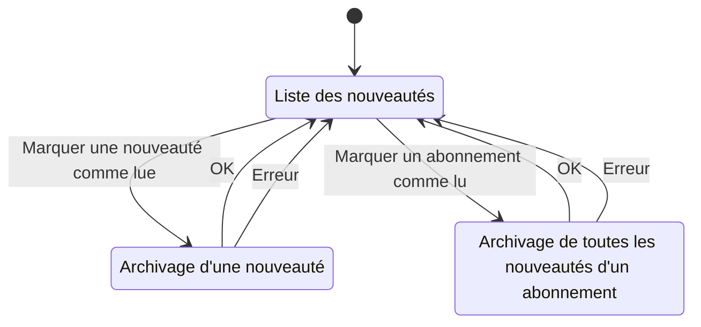

# nouveautes

## Diagramme d'état

Aller à l'état initial : [Liste des nouveautés](#Liste_des_nouveautés)  
## Liste des nouveautés

### Actions

- Marquer une nouveauté comme lue [Archivage d'une nouveauté](#Archivage_d'une_nouveauté)  
- Marquer un abonnement comme lu [Archivage de toutes les nouveautés d'un abonnement](#Archivage_de_toutes_les_nouveautés_d'un_abonnement)  
## Archivage d'une nouveauté

### Actions

- OK [Liste des nouveautés](#Liste_des_nouveautés)  
- Erreur [Liste des nouveautés](#Liste_des_nouveautés)  
## Archivage de toutes les nouveautés d'un abonnement

### Actions

- OK [Liste des nouveautés](#Liste_des_nouveautés)  
- Erreur [Liste des nouveautés](#Liste_des_nouveautés)  
