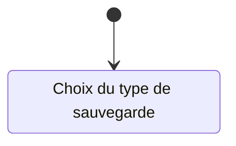

# sauvegarde

## Diagramme d'état

```mermaid
stateDiagram-v2  
%% sauvegarde  
	[*] --> Choix_du_type_de_sauvegarde  
	Choix_du_type_de_sauvegarde: Choix du type de sauvegarde  

```

Aller à l'état initial : [Choix du type de sauvegarde](#Choix_du_type_de_sauvegarde)  
## Choix du type de sauvegarde

### Actions

