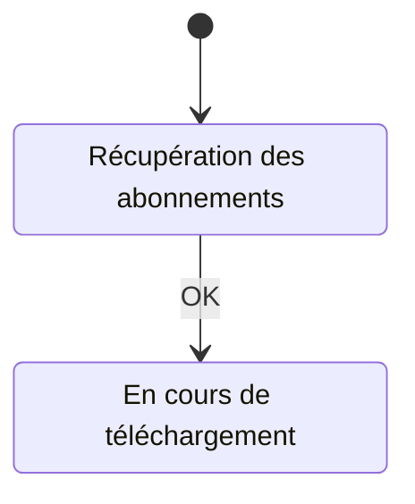

# telecharger

## Diagramme d'état

Aller à l'état initial : [Récupération des abonnements](#Récupération_des_abonnements)  
## Récupération des abonnements

### Actions

- OK [En cours de téléchargement](#En_cours_de_téléchargement)  
## En cours de téléchargement

### Actions

