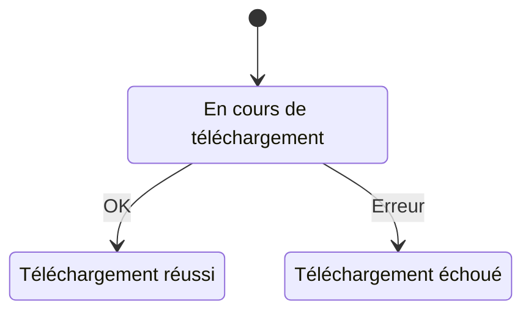

# telechargerUnAbonnement

## Diagramme d'état

Aller à l'état initial : [En cours de téléchargement](#En_cours_de_téléchargement)  
## En cours de téléchargement

### Actions

- OK [Téléchargement réussi](#Téléchargement_réussi)  
- Erreur [Téléchargement échoué](#Téléchargement_échoué)  
## Téléchargement réussi

### Actions

## Téléchargement échoué

### Actions

